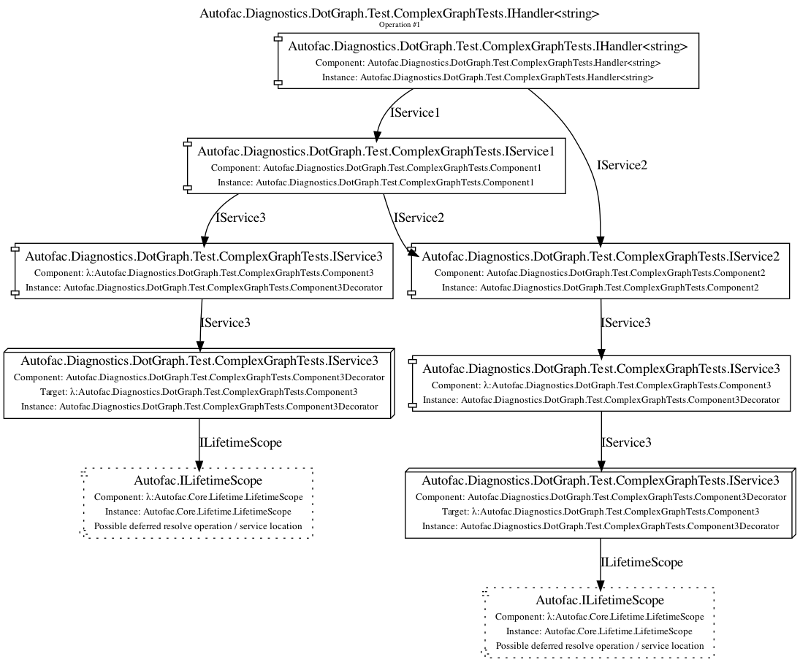
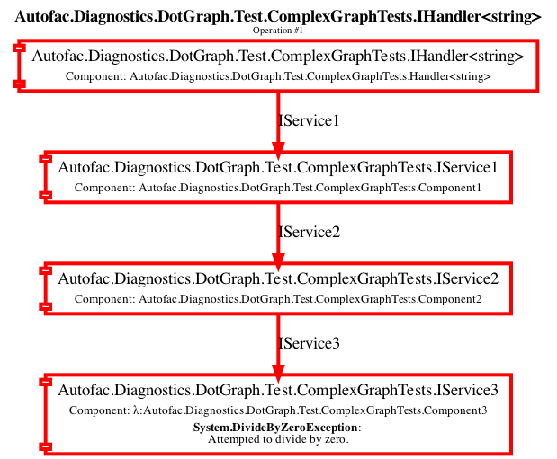

=============================
Debugging and Troubleshooting
=============================

If you're really having trouble and you haven't been able to get `an answer on StackOverflow <https://stackoverflow.com/questions/tagged/autofac>`_ you may want to try doing a little more in-depth debugging/troubleshooting on your own. Here are some tips on doing that.

Exceptions
----------

The exceptions generated by Autofac really try to point you in the right direction with respect to what could be going wrong. Don't panic! Stop and read what it's actually telling you.

For example, say you see a message that starts like::

    None of the constructors found with 'Autofac.Core.Activators.Reflection.DefaultConstructorFinder'
    on type 'Your.EncryptionService' can be invoked with the available
    services and parameters: Cannot resolve parameter 'Your.SecuritySettings securitySettings'
    of constructor 'Void .ctor(Your.SecuritySettings)'

In this case, Autofac is trying to create an instance of your service and it can't resolve a constructor parameter it needs. Chances are you need to look at the things you have registered with Autofac and make sure you have something registered that can fulfill the constructor requirement. You could even verify this by manually trying to resolve the parameter yourself right from the container (in a test/debug environment). You may *think* you have it registered, but for whatever reason Autofac isn't seeing the registration. (Autofac requires you explicitly register all services. Look at the :doc:`Any Concrete Type Not Already Registered registration source <registration-sources>` if you don't want to register everything.)

It may be that the top-level exception message doesn't make sense, but that there are nested inner exceptions that have more information. Check those out! Creating big object graphs can sometimes yield a deep exception tree to help you pinpoint where exactly in the large graph things went wrong. Don't just stop at the top level.

Also, take a look at your exception stack traces. It may look like Autofac is the source of an exception when really it's getting caught by something going wrong in a constructor in one of your objects.

And, of course, if you're hitting that ever-challenging ``No scope with a Tag matching 'AutofacWebRequest'`` exception, :doc:`we have a whole FAQ on that <../faq/per-request-scope>`.

Diagnostics
-----------

Autofac 6.0 introduced diagnostics support in the form of `System.Diagnostics.DiagnosticSource <https://docs.microsoft.com/en-us/dotnet/api/system.diagnostics.diagnosticsource?view=netcore-3.1>`_. This allows you to intercept diagnostic events from Autofac.

.. note::

    Diagnostics aren't free. You will get better performance if you **don't** have a diagnostic listener attached to the container. Further, tracers like ``DefaultDiagnosticTracer`` that generate a full trace of an operation will increase memory and resource usage as they have to hold onto data during the entire resolve operation in order to generate a complete trace. It is recommended you only use diagnostics in a non-production environment; or use diagnostics listeners that handle individual events without tracking full operations.

Quick Start
===========

The easiest way to get started with diagnostics is to use the ``Autofac.Diagnostics.DefaultDiagnosticTracer`` class. This tracer will generate a hierarchical trace of resolution operations that you can use in troubleshooting.

.. sourcecode:: csharp

    // Build your container as you normally would.
    var containerBuilder = new ContainerBuilder();
    containerBuilder.RegisterType<Component>().As<IService>();
    var container = containerBuilder.Build();

    // Create a tracer instance and figure out
    // what you want to do when a trace is ready
    // to be viewed.
    var tracer = new DefaultDiagnosticTracer();
    tracer.OperationCompleted += (sender, args) =>
    {
        Trace.WriteLine(args.TraceContent);
    };

    // Subscribe to the diagnostics with your tracer.
    container.SubscribeToDiagnostics(tracer);

    // Resolve things as normal. The tracer
    // event will be raised whenever something
    // is resolved.
    using var scope = container.BeginLifetimeScope();
    scope.Resolve<IService>();

If you don't have direct access to the container (e.g., in ASP.NET Core) you can use a build callback to register the tracer.

.. sourcecode:: csharp

    public void ConfigureContainer(ContainerBuilder builder)
    {
        // Register Autofac things as you normally would.
        builder.RegisterModule(new AutofacModule());

        // Create a tracer instance and figure out
        // what you want to do when a trace is ready
        // to be viewed. Note: since you're diagnosing
        // the container you probably shouldn't ALSO
        // resolve the logger to which the diagnostics
        // get written.
        var tracer = new DefaultDiagnosticTracer();
        tracer.OperationCompleted += (sender, args) =>
        {
            Console.WriteLine(args.TraceContent);
        };

        builder.RegisterBuildCallback(c =>
        {
            var container = c as IContainer;
            container.SubscribeToDiagnostics(tracer);
        });
    }

Default Diagnostic Tracer
=========================

The quick start above shows how you can get going with the ``Autofac.Diagnostics.DefaultDiagnosticTracer``.

When the ``OperationCompleted`` event gets raised, you'll get event arguments that provide:

* ``Operation`` - the actual resolve operation that completed so you can inspect it if needed.
* ``OperationSucceeded`` - a Boolean value indicating whether the contained trace is for a successful or failed operation.
* ``TraceContent`` - the built string that has the full trace of the resolve operation.

Let's say you have a simple lambda that registers a string.

.. sourcecode:: csharp

    var builder = new ContainerBuilder();
    builder.Register(ctx => "HelloWorld");
    var container = builder.Build();

If you resolve a string from that container, the trace will look like this::

    Resolve Operation Starting
    {
      Resolve Request Starting
      {
        Service: System.String
        Component: λ:System.String

        Pipeline:
        -> CircularDependencyDetectorMiddleware
          -> ScopeSelectionMiddleware
            -> SharingMiddleware
              -> RegistrationPipelineInvokeMiddleware
                -> ActivatorErrorHandlingMiddleware
                  -> DisposalTrackingMiddleware
                    -> λ:System.String
                    <- λ:System.String
                  <- DisposalTrackingMiddleware
                <- ActivatorErrorHandlingMiddleware
              <- RegistrationPipelineInvokeMiddleware
            <- SharingMiddleware
          <- ScopeSelectionMiddleware
        <- CircularDependencyDetectorMiddleware
      }
      Resolve Request Succeeded; result instance was HelloWorld
    }
    Operation Succeeded; result instance was HelloWorld

As you can see, the trace is very detailed - you can see the :doc:`full middleware pipeline <pipelines>` that the resolve operation went through, you'll see the activator (a delegate, in this case), and you'll see the resulting instance.

This can really help when trying to troubleshoot complex resolve issues, though the amount of information can be overwhelming the more complex the trace gets.

An error trace will include where the error occurred and indicate failure::

    Resolve Operation Starting
    {
      Resolve Request Starting
      {
        Service: System.String
        Component: λ:System.String

        Pipeline:
        -> CircularDependencyDetectorMiddleware
          -> ScopeSelectionMiddleware
            -> SharingMiddleware
              -> RegistrationPipelineInvokeMiddleware
                -> ActivatorErrorHandlingMiddleware
                  -> DisposalTrackingMiddleware
                    -> λ:System.String
                    X- λ:System.String
                  X- DisposalTrackingMiddleware
                X- ActivatorErrorHandlingMiddleware
              X- RegistrationPipelineInvokeMiddleware
            X- SharingMiddleware
          X- ScopeSelectionMiddleware
        X- CircularDependencyDetectorMiddleware
      }
      Resolve Request FAILED
        System.DivideByZeroException: Attempted to divide by zero.
          at MyProject.MyNamespace.MyMethod.<>c.<GenerateSimpleTrace>b__6_0(IComponentContext x) in /path/to/MyCode.cs:line 39
          at Autofac.RegistrationExtensions.<>c__DisplayClass39_0`1.<Register>b__0(IComponentContext c, IEnumerable`1 p)
          at Autofac.Builder.RegistrationBuilder.<>c__DisplayClass0_0`1.<ForDelegate>b__0(IComponentContext c, IEnumerable`1 p)
          at Autofac.Core.Activators.Delegate.DelegateActivator.ActivateInstance(IComponentContext context, IEnumerable`1 parameters)
          at Autofac.Core.Activators.Delegate.DelegateActivator.<ConfigurePipeline>b__2_0(ResolveRequestContext ctxt, Action`1 next)
          at Autofac.Core.Resolving.Middleware.DelegateMiddleware.Execute(ResolveRequestContext context, Action`1 next)
          at Autofac.Core.Resolving.Pipeline.ResolvePipelineBuilder.<>c__DisplayClass14_0.<BuildPipeline>b__1(ResolveRequestContext ctxt)
          at Autofac.Core.Resolving.Middleware.DisposalTrackingMiddleware.Execute(ResolveRequestContext context, Action`1 next)
          at Autofac.Core.Resolving.Pipeline.ResolvePipelineBuilder.<>c__DisplayClass14_0.<BuildPipeline>b__1(ResolveRequestContext ctxt)
          at Autofac.Core.Resolving.Middleware.ActivatorErrorHandlingMiddleware.Execute(ResolveRequestContext context, Action`1 next)
    }
    Operation FAILED

See how the return trip through the middleware changed to a ``X-`` in there? We know the error happened while executing the lambda. You can use these hints to see exactly where in the pipeline things are failing.

DOT Graph Tracer
================

In addition to the ``DefaultDiagnosticTracer`` we provide a graphing tracer in the ``Autofac.Diagnostics.DotGraph`` package.

If you add a reference to this package, you'll have the ability to trace out full dependency trees in a visual fashion using `DOT language <https://graphviz.org/doc/info/lang.html>`_. You can then render images with a tool like `Graphviz <https://graphviz.org/>`_.

First, just like with the ``DefaultDiagnosticTracer``, register it with your container. This time the trace output will be a DOT graph.

.. sourcecode:: csharp

    // Build your container as you normally would.
    var containerBuilder = new ContainerBuilder();
    containerBuilder.RegisterType<Component>().As<IService>();
    var container = containerBuilder.Build();

    // Create a DOT graph tracer instance. The
    // trace content will be DOT graph format.
    var tracer = new DotDiagnosticTracer();
    tracer.OperationCompleted += (sender, args) =>
    {
        // Writing the DOT trace to a file will let you render
        // it to a graph with Graphviz later, but this is
        // NOT A GOOD COPY/PASTE EXAMPLE. You'll want to do
        // things in an async fashion with good error handling.
        var path = Path.Combine(Path.GetTempPath(), $"{Guid.NewGuid()}.dot");
        using var file = new StreamWriter(path);
        file.WriteLine(args.TraceContent);
    };

    // Subscribe to the diagnostics with your tracer.
    container.SubscribeToDiagnostics(tracer);

    // Resolve things as normal. The tracer
    // event will be raised whenever something
    // is resolved.
    using var scope = container.BeginLifetimeScope();
    scope.Resolve<IService>();

Let's say you have a simple lambda that registers a string.

.. sourcecode:: csharp

    var builder = new ContainerBuilder();
    builder.Register(ctx => "HelloWorld");
    var container = builder.Build();

The output from the DOT graph tracer will look like this (and, yes, it's messy)::

    digraph G {
    label=<string Operation #1>;
    labelloc=t
    na58baa0161f74ca8a74d3481aff7d182 [shape=component,label=<
    <table border='0' cellborder='0' cellspacing='0'>
    <tr><td port='nb569aeb076c94321a3c17b56bf16fd2c'>string</td></tr>
    <tr><td>Component: λ:string</td></tr>
    </table>
    >];
    }

However, let's say you save that to a file and then convert it to a PNG with Graphviz::

    dot -Tpng -O my-trace.dot

The graphic output looks like this:

.. figure:: media/DotSimpleTrace.png
    :align: center
    :alt: Simple DOT graph for a string resolve.

    Simple DOT graph for a string resolve.

Now it's looking interesting. We can see the resolve was for a string and we can see the request was fulfilled by a lambda.

But what about something more complex? Here's an example of what a complex resolution graph might look like.

    DOT graph for a complex resolve.

Looking at this graph, it tells us a lot of things:

* Both the ``IHandler<string>`` and the ``IService1`` that was resolved need an ``IService2`` and it was fulfilled by a single instance. That means it's either a singleton or maybe an instance-per-lifetime-scope.
* Both the ``IService1`` and ``IService2`` need an ``IService3`` and a new one was created for each instance.
* ``IService3`` is decorated - see how it chains down to a node that looks more like a box? That indicates there's a decorator in play. You can see the component (the decorator) and the target (the thing being decorated) listed in that box.
* ``IService3`` takes in an ``ILifetimeScope`` constructor parameter.

That last one - the ``ILifetimeScope`` parameter - means ``IService3`` might do some service location (manually resolve something) inside the code. If you really want to know the full chain, you might have to correlate this graph with others. But how?

Notice at the top there's an ``Operation #1`` counter - this counter increments for every resolve operation passing through the tracer. You can look for traces that have a larger number and do a little manual correlation. Unfortunately, this is the best we can offer because each resolution is entirely independent - service location breaks the chain. You can't assume all resolves associated with a lifetime scope are correlated because, for example, maybe all the resolutions for an entire application come from a single scope.

Errors will also be highlighted so you can see where the error occurs.

    DOT graph for an error during a resolve.

In this case, you can see the trace all the way down to the location where it failed is highlighted red and bold. You can also see the exception type and message.

Custom Tracers
==============

Using ``System.Diagnostics.DiagnosticSource`` in Autofac allows you to create your own custom tracer that can handle various events and generate the data that interests you.

Events in the overall pipeline happen in this order:

* Operation start
    * Resolve request start
        * Middleware start
        * Middleware success / fail
    * Resolve request success / fail
* Operation success / fail

Middleware may start additional resolve requests; and there's more than one middleware item in the pipeline. You can dig deeper on this in the :doc:`Pipelines <pipelines>` page.

If you want to trace an *entire operation* from end to end, similar to the ``DefaultDiagnosticTracer``, you can start with the ``Autofac.Diagnostics.OperationDiagnosticTracerBase<TContent>`` class. This is the class on which the ``DefaultDiagnosticTracer`` is based. It is intentionally wired up to listen to all resolve events, from start to end, and track a full operation at a time. Your best example of this is to `look at the source code for DefaultDiagnosticTracer <https://github.com/autofac/Autofac/blob/dca791ca0dbd1aa1cb0ad821539381df403d6d52/src/Autofac/Diagnostics/DefaultDiagnosticTracer.cs>`_. Given there are a lot of events to handle, there's a lot of data to capture.

You can take a little more control and trace *only certain events* by using ``Autofac.Diagnostics.DiagnosticTracerBase``. This is a ``DiagnosticListener`` that adds some strongly-typed parsing to the events to help you write a little less code. Here's a tracer that logs to console when a resolve operation starts:

Here's an example tracer that traces full operations and just keeps a simple stack of data similar to the ``DefaultDiagnosticTracer`` but far less fancy.

.. sourcecode:: csharp

    public class ConsoleOperationTracer : DiagnosticTracerBase
    {
        public ConsoleOperationTracer()
            : base()
        {
            EnableBase("Autofac.Operation.Start");
        }

        protected override void OnOperationStart(OperationStartDiagnosticData data)
        {
            Console.WriteLine("Operation starting.");
        }
    }

Now you can use your custom tracer. It won't raise any event, but it'll log what you want.

.. sourcecode:: csharp

    // Build your container as you normally would.
    var containerBuilder = new ContainerBuilder();
    containerBuilder.RegisterType<Component>().As<IService>();
    var container = containerBuilder.Build();

    // Subscribe to the diagnostics with your tracer.
    container.SubscribeToDiagnostics<ConsoleOperationTracer>();

If you want *even more control* you can use the standard ``IObserver<KeyValuePair<string, object>>`` support that ``System.Diagnostics.DiagnosticListener`` uses by default. Here's that same console logging listener in that format:

.. sourcecode:: csharp

    public class ConsoleOperationTracer : IObserver<KeyValuePair<string, object>>
    {
        public void OnCompleted()
        {
        }

        public void OnError(Exception error)
        {
        }

        public void OnNext(KeyValuePair<string, object> value)
        {
            // The tracer will only be called on operation start
            // because that's how we're going to register it.
            //
            // value.Value is an OperationStartDiagnosticData when
            // the operation start event is raised, but this logger
            // doesn't use that.
            Console.WriteLine("Operation starting.");
        }
    }

As you can see, you can write some very tight, performant code if you get down to the metal.

When you get this low, you can control the subscriptions for your events separately from the tracer. You have to register your tracer directly with the container ``DiagnosticSource``.

.. sourcecode:: csharp

    // Subscribe to the diagnostics with your tracer.
    // Note the lambda that tells how to determine if
    // the tracer should get an event.
    var tracer = new ConsoleOperationTracer();
    container.DiagnosticSource.Subscribe(tracer, e => e == "Autofac.Operation.Start");

Symbols and Sources
-------------------

Autofac packages have been updated `to use Source Link <https://github.com/dotnet/sourcelink>`_ so you can debug right from your code into the Autofac source. Packages may have the symbols right inside or they may be in the `NuGet Symbol Server <https://docs.microsoft.com/en-us/nuget/create-packages/symbol-packages-snupkg#nugetorg-symbol-server>`_.

**In Visual Studio**, there's an option to enable searching the NuGet symbol server. `See the documentation from Microsoft explaining how to configure Visual Studio to make symbol servers work. <https://docs.microsoft.com/en-us/visualstudio/debugger/specify-symbol-dot-pdb-and-source-files-in-the-visual-studio-debugger>`_

**In VS Code**, you may need to set the debugging options up in ``settings.json`` or ``launch.json``.

A ``settings.json`` block to enable symbols during unit test debugging looks like this:

.. sourcecode:: json

    {
      "csharp.unitTestDebuggingOptions": {
        "symbolOptions": {
          "searchMicrosoftSymbolServer": true,
          "searchNuGetOrgSymbolServer": true
        }
      }
    }

To launch your application with symbols enabled, ``launch.json`` might look something like this:

.. sourcecode:: json

    {
      "configurations": [
        {
          "console": "internalConsole",
          "cwd": "${workspaceFolder}/src/MyProject",
          "env": {
            "ASPNETCORE_ENVIRONMENT": "Development",
            "ASPNETCORE_URLS": "https://localhost:5000",
            "COMPlus_ReadyToRun": "0",
            "COMPlus_ZapDisable": "1"
          },
          "justMyCode": false,
          "name": "Launch with SourceLink (Development)",
          "preLaunchTask": "build",
          "program": "${workspaceFolder}/src/MyProject/bin/Debug/net6.0/MyProject.dll",
          "request": "launch",
          "serverReadyAction": {
            "action": "openExternally",
            "pattern": "\\bNow listening on:\\s+(https?://\\S+)",
            "uriFormat": "%s"
          },
          "stopAtEntry": false,
          "suppressJITOptimizations": true,
          "symbolOptions": {
            "searchMicrosoftSymbolServer": true,
            "searchNuGetOrgSymbolServer": true
          },
          "type": "coreclr"
        }
      ],
      "version": "0.2.0"
    }

Support
-------

We have a :doc:`whole page outlining how to get support <../support>`.
