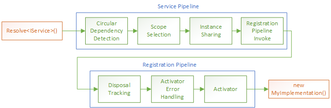

=================
Resolve Pipelines
=================

In Autofac (from version 6.0 onwards), the work of actually resolving an instance of a registration when a service is requested is implemented as a **pipeline**, consisting of multiple **middleware**. Each individual middleware represents some part of the process required to construct or locate your instance and return it to you.

For advanced customization scenarios, Autofac allows you to add your own middleware into the pipeline to intercept, short-circuit or extend the existing resolve behavior.

Service Pipelines vs Registration Pipelines
===========================================

An individual resolve request actually ends up invoking two different pipelines. The Service Pipeline, and the Registration Pipeline.

Each :doc:`service <../glossary>` has its own Service Pipeline, and each :doc:`registration <../glossary>` has its own Registration Pipeline.

Lets take a look at the 'default' execution pipeline for a typical service:

    An example resolve pipeline consisting of a Service Pipeline and a Registration Pipeline.

The Service Pipeline is attached to a given service, the thing you use to resolve something. These are common for all resolves of the service, regardless of the actual registration that supplies an instance.

The Registration Pipeline is attached to each individual registration, and applies to all resolves that invoke that registration, regardless of the service used to resolve it.

We can use this notion of separated pipelines to attach behavior to either all invocations of a given service (:doc:`decorators <adapters-decorators>` do this), or to an individual registration (for example, adding :doc:`lifetime events </lifetime/events>` to the pipeline).

Pipeline Phases
===============

When we add middleware to a pipeline, we need to specify which **phase** of the pipeline the middleware should run in.

By specifying a phase, we allow ordering of middleware inside the pipeline, so we are not dependent on the actual order in which middleware is added.

Here's the available pipeline phases, broken up into service phases and registration phases.

.. table::
    :widths: 40 60

    +----------------------------------------------------------------------------------------------------------------------------------------------------------------+
    |                                                                     Service Pipeline Phases                                                                    |
    +===========================+====================================================================================================================================+
    | ResolveRequestStart       | The start of a resolve request. Custom middleware added to this phase executes before circular dependency detection.               |
    +---------------------------+------------------------------------------------------------------------------------------------------------------------------------+
    | ScopeSelection            | In this phase, the lifetime scope selection takes place. If some middleware needs to change the lifetime scope to resolve against, |
    |                           | it happens here (but bear in mind that the configured Autofac lifetime for the registration will still take effect).               |
    +---------------------------+------------------------------------------------------------------------------------------------------------------------------------+
    | Decoration                | In this phase, instance decoration will take place (on the way 'out' of the pipeline).                                             |
    +---------------------------+------------------------------------------------------------------------------------------------------------------------------------+
    | Sharing                   | At the end of this phase, if a shared instance satisfies the request, the pipeline will stop executing and exit. Add custom        |
    |                           | middleware to this phase to choose your own shared instance.                                                                       |
    +---------------------------+------------------------------------------------------------------------------------------------------------------------------------+
    | ServicePipelineEnd        | This phase occurs just before the service pipeline ends (and the registration pipeline is about to start).                         |
    +---------------------------+------------------------------------------------------------------------------------------------------------------------------------+

.. table::
    :widths: 40 60

    +----------------------------------------------------------------------------------------------------------------------------------------------------------------+
    |                                                                  Registration Pipeline Phases                                                                  |
    +===========================+====================================================================================================================================+
    | RegistrationPipelineStart | This phase occurs at the start of the registration pipeline.                                                                       |
    +---------------------------+------------------------------------------------------------------------------------------------------------------------------------+
    | ParameterSelection        | This phase runs just before Activation, is the recommended point at which the resolve parameters should be replaced if needed.     |
    +---------------------------+------------------------------------------------------------------------------------------------------------------------------------+
    | Activation                | The Activation phase is the last phase of a pipeline, where a new instance of a component is created.                              |
    +---------------------------+------------------------------------------------------------------------------------------------------------------------------------+

.. note::

    If you attempt to specify a service pipeline phase when adding registration middleware (or vice versa),
    you will get an error. You need to use the appropriate phase depending on which pipeline you are adding to.

Adding Registration Middleware
==============================

Lets take a look at how we can insert our own middleware into the registration pipeline when we create a registration, with a simple 'Hello World' lambda middleware that prints some information to the console:

.. code-block:: csharp

    var builder = new ContainerBuilder();

    builder.RegisterType<MyImplementation>().As<IMyService>().ConfigurePipeline(p =>
    {
        // Add middleware at the start of the registration pipeline.
        p.Use(PipelinePhase.RegistrationPipelineStart, (context, next) =>
        {
            Console.WriteLine("Before Activation - Requesting {0}", context.Service);

            // Call the next middleware in the pipeline.
            next(context);

            Console.WriteLine("After Activation - Instantiated {0}", context.Instance);
        });
    });

You can see that we call the next middleware in the pipeline using the ``next`` callback provided, allowing the resolve operation to continue.

You have access to the created instance after ``next`` returns. This is because calling ``next`` invokes the next middleware in the pipeline, which also calls ``next``, and so on, until the end of the pipeline, when the instance is activated.

If you don't invoke that ``next`` callback, the pipeline ends, and we return back up to the caller.

Defining Middleware Classes
---------------------------

In addition to providing middleware via a lambda function, you can also define your own middleware classes, and add instances of those to the pipeline:

.. code-block:: csharp

    class MyCustomMiddleware : IResolveMiddleware
    {
        public PipelinePhase Phase => PipelinePhase.RegistrationPipelineStart;

        public void Execute(ResolveRequestContext context, Action<ResolveRequestContext> next)
        {
            Console.WriteLine("Before Activation - Requesting {0}", context.Service);

            // Call the next middleware in the pipeline.
            next(context);

            Console.WriteLine("After Activation - Instantiated {0}", context.Instance);
        }
    }

    // ....

    builder.RegisterType<MyImplementation>().As<IMyService>().ConfigurePipeline(p =>
    {
        p.Use(new MyCustomMiddleware());
    });

The two ways of adding middleware behave identically, but defining a class may help if you have complex middleware.

Adding Middleware to All Registrations
--------------------------------------

If you want to add a piece of middleware to all registrations, you can use the ``Registered`` event in the same way you would have added other shared registration behavior:

.. code-block:: csharp

    // Add MyCustomMiddleware to every registration.
    builder.ComponentRegistryBuilder.Registered += (sender, args) =>
    {
        // The PipelineBuilding event fires just before the pipeline is built, and
        // middleware can be added inside it.
        args.ComponentRegistration.PipelineBuilding += (sender2 , pipeline) =>
        {
            pipeline.Use(new MyCustomMiddleware());
        };
    };

ResolveRequestContext
=====================

The context object passed into all middleware is an instance of ``ResolveRequestContext``. This object stores the initial attributes of a resolve request, and any properties updated while the request executes.

You can use this context to:

- Check the service being resolved with the ``Service`` property.
- Check the Registration being used to provide the service.
- Get or set the result of the resolve operation with the ``Instance`` property.
- Access the parameters of the request with the ``Parameters`` property and change those parameters with the ``ChangeParameters`` method.
- Resolve another service (using any of the normal Resolve methods).

.. note::

    ``ResolveRequestContext`` is an abstract base class. If you want to write unit tests for your
    middleware you can mock it and pass the mock into your middleware implementation.

Adding Service Middleware
=========================

Service middleware is attached to a service, rather than a specific registration. So when we add service middleware we can add behavior for all resolves of the service, without caring which registration is providing the instance.

You add service middleware directly onto the ``ContainerBuilder``:

.. code-block:: csharp

    var builder = new ContainerBuilder();

    // Run some middleware at the very start of the pipeline, before any core Autofac behavior.
    builder.RegisterServiceMiddleware<IMyService>(PipelinePhase.ResolveRequestStart, (context, next) =>
    {
        Console.WriteLine("Requesting Service: {0}", context.Service);

        next(context);
    });

Just like with registration middleware, you can register middleware classes instead of lambdas:

.. code-block:: csharp

    builder.RegisterServiceMiddleware<IMyService>(new MyServiceMiddleware());

If the service type isn't known at compile time - you're looping over types found by a scan, say - there are overloads that take a ``Type`` instead of a generic parameter:

.. code-block:: csharp

    foreach (var serviceType in assembly.GetTypes().Where(t => t.IsInterface))
    {
        builder.RegisterServiceMiddleware(serviceType, PipelinePhase.ResolveRequestStart, (context, next) =>
        {
            next(context);
        });
    }

Two optional arguments are worth knowing about. A ``descriptor`` names the middleware in :doc:`resolve traces <../troubleshooting/tracing>`, so a trace reads ``custom-middleware`` instead of ``anonymous``. A ``MiddlewareInsertionMode`` of ``StartOfPhase`` puts your middleware ahead of the other middleware in the same phase rather than after it.

.. code-block:: csharp

    builder.RegisterServiceMiddleware<IMyService>(
        "tenant-resolution",
        PipelinePhase.ScopeSelection,
        MiddlewareInsertionMode.StartOfPhase,
        (context, next) => next(context));

Examples
========

The middleware API is general enough that it's not obvious when you'd reach for it. These are the shapes that come up most often.

Timing a Resolve
----------------

Wrapping the activation phase measures how long it takes to construct a component. ``NewInstanceActivated`` distinguishes a real activation from a shared instance being handed back, so you don't record timings for work that never happened.

.. code-block:: csharp

    builder.RegisterType<ExpensiveComponent>().ConfigurePipeline(p =>
    {
        p.Use(PipelinePhase.Activation, MiddlewareInsertionMode.StartOfPhase, (context, next) =>
        {
            var stopwatch = Stopwatch.StartNew();
            next(context);
            stopwatch.Stop();

            if (context.NewInstanceActivated)
            {
                Console.WriteLine("Activated {0} in {1}ms", context.Service, stopwatch.ElapsedMilliseconds);
            }
        });
    });

Substituting Parameters
-----------------------

``ParameterSelection`` runs just before activation, which makes it the place to change what gets passed to the constructor. Use ``ChangeParameters`` rather than assigning to ``Parameters``, and append to the existing set so an explicitly-passed parameter still wins.

.. code-block:: csharp

    builder.RegisterType<ReportGenerator>().ConfigurePipeline(p =>
    {
        p.Use(PipelinePhase.ParameterSelection, (context, next) =>
        {
            var extra = new TypedParameter(typeof(IClock), new SystemClock());
            context.ChangeParameters(context.Parameters.Concat(new[] { extra }));

            next(context);
        });
    });

Short-Circuiting a Resolve
--------------------------

Setting ``Instance`` and *not* calling ``next`` ends the pipeline and returns your object. This is how you supply an instance from somewhere Autofac doesn't know about - an external cache, for example.

.. code-block:: csharp

    builder.RegisterServiceMiddleware<IPricingTable>(PipelinePhase.Sharing, (context, next) =>
    {
        if (cache.TryGet(out IPricingTable cached))
        {
            // Skip activation entirely; nothing further in the pipeline runs.
            context.Instance = cached;
            return;
        }

        next(context);
        cache.Store((IPricingTable)context.Instance);
    });

Bear in mind that an instance you supply this way was not activated by Autofac, so it isn't tracked for disposal and the :doc:`lifetime events <../lifetime/events>` don't fire for it. If the cached object needs cleaning up, that's yours to arrange.

Applying Behavior Across Many Services
--------------------------------------

Service middleware plus the ``Type`` overloads cover the "apply this to everything" case that would otherwise mean an extension method on every single registration. Because it attaches to the *service*, it runs no matter which registration ends up satisfying the request - including through :doc:`decorators <adapters-decorators>`, where a registration-level hook would only see the innermost component.

.. code-block:: csharp

    var auditableServices = typeof(Program).Assembly
        .GetTypes()
        .Where(t => t.IsInterface && t.IsDefined(typeof(AuditedAttribute), false));

    foreach (var serviceType in auditableServices)
    {
        builder.RegisterServiceMiddleware(serviceType, "audit", PipelinePhase.ResolveRequestStart, (context, next) =>
        {
            next(context);
            auditLog.Record(context.Service, context.Instance);
        });
    }

Service Middleware Sources
==========================

In a similar way to :doc:`registration sources <registration-sources>`, you can add a **service middleware source** if you want to add service middleware dynamically at runtime.

This can be particularly useful for things like open generic services, where we don't know the **actual** service type until runtime.

You define a service middleware source by implementing ``IServiceMiddlewareSource``, and registering your source with the ``ContainerBuilder``.

.. code-block:: csharp

    class MyServiceMiddlewareSource : IServiceMiddlewareSource
    {
        public void ProvideMiddleware(Service service, IComponentRegistryServices availableServices, IResolvePipelineBuilder pipelineBuilder)
        {
            // Add some middleware to the Sharing phase of every service.
            pipelineBuilder.Use(PipelinePhase.Sharing, (context, next) =>
            {
                Console.WriteLine("I'm on every service!");

                next(context);
            });
        }
    }

    // ...

    builder.RegisterServiceMiddlewareSource(new MyServiceMiddlewareSource());
