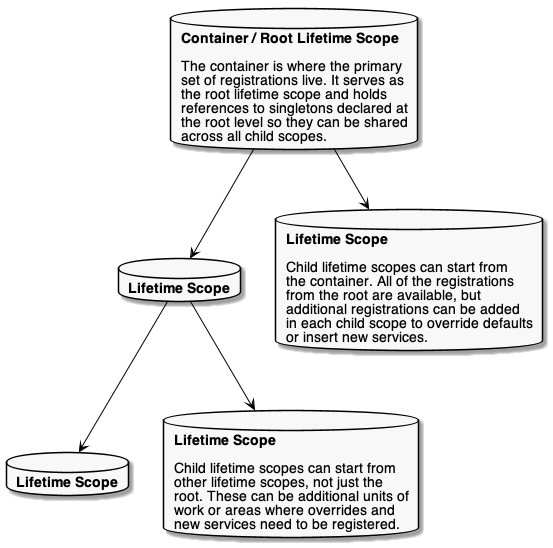
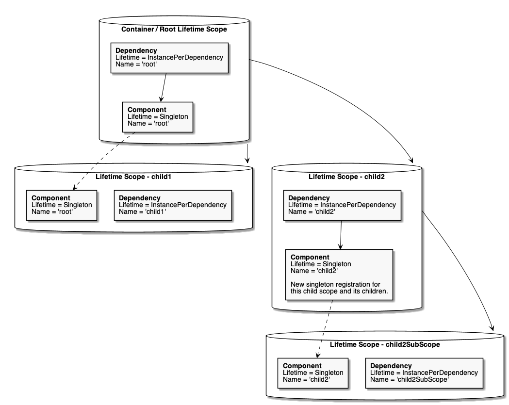
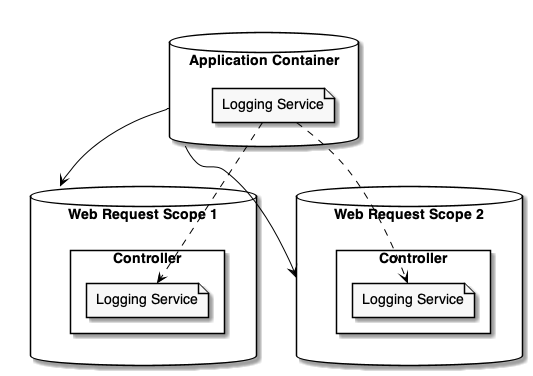

==============================
Controlling Scope and Lifetime
==============================

You may recall from the :doc:`registration topic <../register/registration>` that you add **components** to the container that implement **services**. You then end up :doc:`resolving services <../resolve/index>` and using those service instances to do your work. However, you still might wonder...

- When do components get instantiated?
- When do components get disposed?
- How can I ensure a singleton is correctly shared in my application?
- How do I control any of this?

Note: Most of the content here is based on `Nick Blumhardt's Autofac lifetime primer <http://nblumhardt.com/2011/01/an-autofac-lifetime-primer/>`_. While some things in Autofac have changed over time, the concepts described there remain valid and may be helpful in understanding lifetime scopes.

------------------------------
Basic Concepts and Terminology
------------------------------

The **lifetime** of a service is how long the service instance will live in your application - from the original instantiation to :doc:`disposal <disposal>`. For example, if you "new up" an object that implements `IDisposable <https://msdn.microsoft.com/en-us/library/system.idisposable.aspx>`_ and then later call ``Dispose()`` on it, the lifetime of that object is from the time you instantiated it all the way through disposal (or garbage collection if you didn't proactively dispose it).

.. sourcecode:: csharp

    // A lifetime analogy in plain C#:
    using (var component = new DisposableComponent())
    {
      // The "lifetime" of the component here is from
      // the point at which the constructor is called
      // until the time Dispose() is called.
    }

The **scope** of a service is the area in the application where that service can be shared with other components that consume it. For example, in your application you may have a global static singleton - the "scope" of that global object instance would be the whole application. On the other hand, you might create a local variable in a ``for`` loop that makes use of the global singleton - the local variable has a much smaller scope than the global.

.. sourcecode:: csharp

    // Scope in Autofac is somewhat analogous to variable
    // scoping in C#.
    //
    // The "scope" of this static string is global - it
    // can be accessed by anything.
    public static string Singleton = "single-instance";
    using (var component = new DisposableComponent())
    {
      // The scope of "component" is just within these
      // braces. You can't use it out there, but the
      // component can use the shared singleton.
      for (var i = 0; i < 10; i++)
      {
        // The scope of "i" is only inside the for loop,
        // but the singleton is still available, as is
        // the component.
        component.DoWork(Singleton, i);
      }
    }

The concept of a **lifetime scope** in Autofac combines these two notions. Effectively, **a lifetime scope equates with a unit of work in your application**. A unit of work might begin a lifetime scope at the start, then services required for that unit of work get resolved from a lifetime scope. As you resolve services, Autofac tracks disposable (``IDisposable``) components that are resolved. At the end of the unit of work, you dispose of the associated lifetime scope and Autofac will automatically clean up/dispose of the resolved services.

**The two important things lifetime scopes control are sharing and disposal.**

- **Lifetime scopes are nestable and they control how components are shared.** For example, a "singleton" service might be resolved from a root lifetime scope while individual units of work may require their own instances of other services. You can determine how a component is shared by :doc:`setting its instance scope at registration <instance-scope>`.
- **Lifetime scopes track disposable objects and dispose of them when the lifetime scope is disposed.** For example, if you have a component that implements ``IDisposable`` and you resolve it from a lifetime scope, the scope will hold onto it and dispose of it for you so your service consumers don't have to know about the underlying implementation. :doc:`You have the ability to control this behavior or add new disposal behavior if you choose. <disposal>`

As you work in your application, it's good to remember these concepts so you make the most efficient use of your resources.

    **It is important to always resolve services from a lifetime scope and not the root container.** Due to the disposal tracking nature of lifetime scopes, if you resolve a lot of disposable components from the container (the "root lifetime scope"), you may inadvertently cause yourself a memory leak. The root container will hold references to those disposable components for as long as it lives (usually the lifetime of the application) so it can dispose of them. :doc:`You can change disposal behavior if you choose <disposal>`, but it's a good practice to only resolve from a scope. If Autofac detects usage of a singleton or shared component, it will automatically place it in the appropriate tracking scope.

--------------------
Scopes and Hierarchy
--------------------

The easiest way to visualize lifetime scopes is as a hierarchy, like a tree. You start with the root container - the *root lifetime scope* - and each unit of work (web request, etc.) - each *child lifetime scope* - branches off from there.

When you build an Autofac container, what you're creating is that root container/lifetime scope. :doc:`Application integration packages <../integration/index>` or application code can create child lifetime scopes from the container, or even create children from other children.

Lifetime scopes help determine where dependencies come from. *In general*, a component will try to get its dependencies from the lifetime scope resolving the component. For example, if you're in one of the child lifetime scopes and try to resolve something, Autofac will try to get all of the component's dependencies from the child scope.

What affects this mechanism is the "lifetime" aspect of "lifetime scope." Some components, like singletons need to be shared across multiple scopes. This affects how dependencies get located. The "basic rules" are:

- A child lifetime scope can get dependencies from parent scopes, but a parent scope may not reach down into a child scope. (You can locate things by moving "up the tree" but you can't move "down the tree.")
- A component will get its dependencies *from the scope that owns the component* even if the component is resolved by a scope further down the tree. We'll discuss this below with an example on singleton lifetime.

Part of the job of the lifetime scope is to :doc:`handle disposal of the components you resolve <disposal>`. When you resolve a component that implements ``IDisposable``, the owning lifetime scope will hold a reference to the component so it can be properly disposed when the scope is disposed. :doc:`You can dig deeper into how to work with disposal <disposal>` if you like, but some basic things to consider:

- If you resolve ``IDisposable`` items from the root lifetime scope (container) they will be held until the container is disposed, which is generally at application end. **This can cause a memory leak.** Always try to resolve things from child lifetime scopes and dispose of the scopes when you're done with them.
- Disposing a parent lifetime scope does not automatically dispose of the children. Using the diagram as an example, if you dispose of the root lifetime scope it will not dispose of the four child scopes out there. It's up to you as the creator of lifetime scopes to responsibly dispose them.
- If you dispose a parent scope but keep using the child scope, things will fail. You can't resolve dependencies from a disposed scope. It's recommended you dispose scopes in the reverse order created.

You can read more about :doc:`working with lifetime scopes <working-with-scopes>` (including more code examples!), :doc:`component disposal <disposal>` and the different :doc:`instance scopes available <instance-scope>` in the respective documentation.

---------------------------
Example: Singleton Lifetime
---------------------------

Earlier we noted that a component will get its dependencies from the scope that owns the component. Let's dive into this with an example: singletons.

**When you declare a singleton, it's owned by the scope in which it's registered.**

- If you declare a singleton when building your container, it's held by the root lifetime scope. When you resolve a singleton registered this way, *all of its dependencies will come from the root scope*.
- When creating a child lifetime scope, you can add singletons - those will be held by the child lifetime scope in which they're registered. When you resolve it, *all of its dependencies will come from that child lifetime scope*.

Doing it this way ensures you can't dispose dependencies out from under the singleton; and that you won't create a memory leak by holding references to things in child scopes after the scope is disposed.

Let's say you have a couple of classes like this:

.. sourcecode:: csharp

    public class Component
    {
      private readonly Dependency _dep;

      public string Name => this._dep.Name;

      public Component(Dependency dep)
      {
        this._dep = dep;
      }
    }

    public class Dependency
    {
      public string Name { get; }

      public Dependency(string name)
      {
        this.Name = name;
      }
    }

Now let's say you have some code that builds a container and uses these classes.

.. sourcecode:: csharp

    var builder = new ContainerBuilder();

    // A singleton declared at container build
    // time will be owned by the root scope and get
    // all dependencies from the root scope.
    builder.RegisterType<Component>()
           .SingleInstance();

    // Anything that resolves a Dependency from
    // the root lifetime scope will see the name
    // as 'root'
    builder.Register(ctx => new Dependency("root"));

    var container = builder.Build();

    // Resolve the component from the root lifetime scope.
    var rootComp = container.Resolve<Component>();

    // This will show "root"
    Console.WriteLine(rootComp.Name);

    // Even if we override the Dependency in a child
    // scope, it'll still show "root"
    using (var child1 = container.BeginLifetimeScope(
      b => b.Register(ctx => new Dependency("child1")))
    {
      child1Comp = child1.Resolve<Component>();
      Console.WriteLine(child1Comp.Name);
    }

    // You can override the singleton by adding a new
    // singleton in a child scope. This one will be
    // owned by the child and will work in its children,
    // but it doesn't override at the root scope.
    using (var child2 = container.BeginLifetimeScope(
      b => b.Register(ctx => new Dependency("child2")))
    {
      var child2Comp = child2.Resolve<Component>();

      // This will show "child2"
      Console.WriteLine(child2Comp.Name);

      // rootComp and child2Comp are TWO DIFFERENT SINGLETONS.
      Debug.Assert(rootComp != child2Comp);

      using (var child2SubScope = scope.BeginLifetimeScope(
        b => b.Register(ctx => new Dependency("child2SubScope")))
      {
        var child2SubComp = child2SubScope.Resolve<Component>();

        // This will show "child2"
        Console.WriteLine(child2SubComp.Name);

        // child2Comp and child2SubComp are THE SAME.
        Debug.Assert(child2Comp == child2SubComp);
      }
    }

In picture format, it looks like this:

As you can see, lifetime scope plays a role not only in how long a component lives but also where it gets its dependencies. As you design your application, you need to consider this so you don't run into issues where you think you're overriding a value but you're foiled by the component's declared lifetime. You can read more about the options for component instance scope :doc:`in our instance scope docs <instance-scope>`.

------------------------
Example: Web Application
------------------------

Let's look at a web application as a more concrete example to illustrate lifetime scope usage. Say you have the following scenario:

- You have a global singleton logging service.
- Two simultaneous requests come in to the web application.
- Each request is a logical "unit of work" and each requires its own order processing service.
- Each controller needs to log information to the logging service.

In this scenario, you'd have a root lifetime scope that contains the singleton logging service and you'd have one child lifetime scope per request, each with its own controller instance.

From a class registration standpoint, it might look like this:

.. sourcecode:: csharp

    var builder = new ContainerBuilder();

    // The logger is a singleton - shared everywhere.
    builder.RegisterType<Logger>()
           .As<ILogger>()
           .SingleInstance();

    // Controllers are created per lifetime scope. They
    // take an ILogger as a parameter.
    builder.RegisterType<Controller>()
           .InstancePerLifetimeScope();

    var container = builder.Build();

As web requests come in, lifetime scopes might look like this:

A rough sequence of events for a web app framework like :doc:`ASP.NET Core <../integration/aspnetcore>` goes like this:

1. When a web request comes in, the web application framework creates a child lifetime scope - the "request lifetime scope."
2. The web application framework resolves the controller instance from the request lifetime scope. Since the controller is registered as "instance per lifetime scope," it will be a sort of "singleton" within that request but will not be shared with other requests.
3. The logging service, registered as a singleton at the application level, gets injected as a dependency into each controller instance.
4. At the end of each web request, the request lifetime scope will be disposed and the controllers will be garbage collected. The logger will remain alive and cached at the root lifetime scope so it can continue to be injected for the rest of the application lifetime.
5. At the end of the web application (during shutdown) the web app framework should dispose of the root container and release the logger.

----------------------------
Additional Topics to Explore
----------------------------

.. toctree::

    working-with-scopes.rst
    instance-scope.rst
    captive-dependencies.rst
    disposal.rst
    events.rst
    startup.rst
